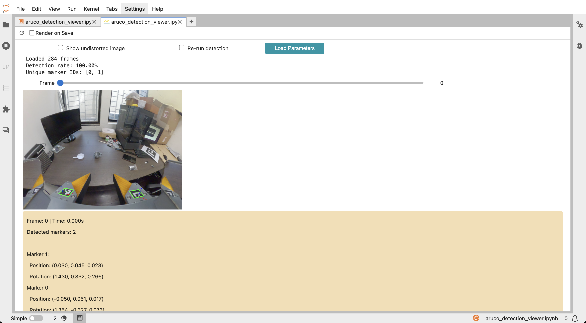
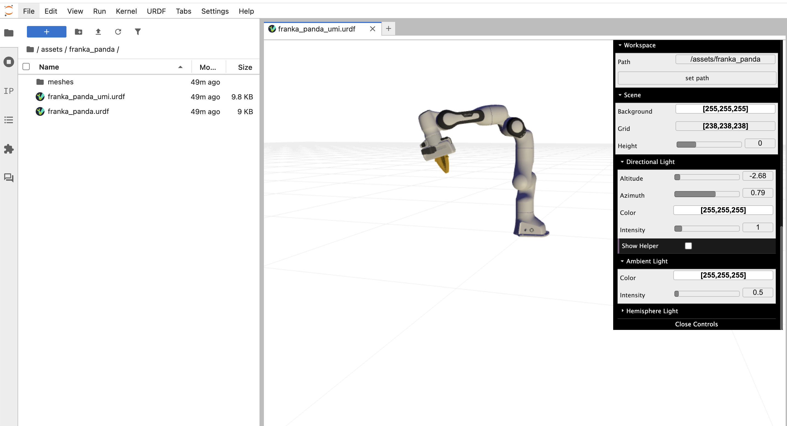

# Visualization tools

Four browser-based viewers for inspecting a UMI session on disk, plus the URDF viewer that ships with JupyterLab here, for QA-ing demonstrations before you train on them.

**Read this if:** you have run the SLAM pipeline (Simultaneous Localization and Mapping — here ORB-SLAM3 recovering the camera path from the video) or been handed a session directory, and want to look at what came out before spending GPU hours on it.

**Before you start:** [Getting started](./getting-started.md), [Data formats](./data-formats.md)

---

## Install the dev extras first

All four viewers need packages that live in the `dev` optional-dependency group, not the default one.

```bash
cd /path/to/voilab
make install-dev
```

That target runs `uv sync --extra dev` (`Makefile:18-22`), which pulls in `plotly`, `notebook`, `ipython[all]`, `ipympl`, `anywidget`, `kaleido` and the vendored `jupyterlab-urdf` wheel (`pyproject.toml:34-45`).

**Known issue:** a plain `uv sync` (via `make install`) produces an environment where three of the four viewers fail, because `plotly` is dev-only but is imported at module top level in `src/voilab/applications/replay_buffer_viewer.py:5` and `src/voilab/applications/dataset_visualizer.py:16`, and in the first code cell of `nbs/slam_viewer.ipynb`. Only the ArUco viewer, which uses matplotlib, survives. Always use `make install-dev`. See [Known issues](./known-issues.md).

## The two ways to open a viewer

Each viewer is a Jupyter notebook in `nbs/` that calls a thin `show()` function from `src/voilab/applications/`. **Voila** is a server that runs such a notebook and serves only its widget output as a web page, hiding the code cells — so a viewer looks like an app, not a notebook.

**Route A — the `voilab` CLI.** Two of the four notebooks have a launcher command:

```bash
cd /path/to/voilab
uv run voilab launch-viewer              # replay buffer viewer
uv run voilab launch-dataset-visualizer  # dataset visualizer
```

Both notebooks open with a default path pointing at data a fresh clone does not have. The first thing to do in either viewer is replace the path in the text box at the top with your own session path.

Both start Voila with `--no-browser` and print a URL to open (`src/voilab/cli.py:15-26`). Voila serves on `http://localhost:8866` by default; JupyterLab on port 8888, with a tokenised URL printed in the terminal. Working over SSH on a lab machine? Forward both first: `ssh -L 8866:localhost:8866 -L 8888:localhost:8888 <user>@<host>`.

**Known issue:** the notebook paths passed to Voila are relative strings (`src/voilab/cli.py:18`, `src/voilab/cli.py:25`), so both commands only work when your working directory is the repo root.

**Route B — JupyterLab, then "Open With > voila".** This route reaches all four notebooks and is also how you edit them:

```bash
cd /path/to/voilab
make launch-jupyterlab
```

That runs `uv run jupyter lab --ip 0.0.0.0 --port 8888 --no-browser` and depends on `install-dev`, so it syncs the extras for you (`Makefile:24-28`). In the left file browser open `nbs/`, right-click a notebook, and choose **Open With > voila** to get the app view — or double-click and Run All to get the same widgets inline with the code visible.

A *session* is one recording outing (one directory); a *demo* is one video inside it; an *episode* is one demonstration segment inside the packed dataset. Full tree: [Data formats](./data-formats.md).

| Viewer | Notebook | Module | CLI command | Input |
|---|---|---|---|---|
| Replay buffer viewer | `nbs/replay_buffer_viewer.ipynb` | `voilab.applications.replay_buffer_viewer` | `launch-viewer` | one `dataset.zarr.zip` |
| Dataset visualizer | `nbs/dataset_visualizer.ipynb` | `voilab.applications.dataset_visualizer` | `launch-dataset-visualizer` | one session directory |
| ArUco detection viewer | `nbs/aruco_detection_viewer.ipynb` | `voilab.applications.aruco_detection_viewer` | none | one demo directory |
| SLAM trajectory viewer | `nbs/slam_viewer.ipynb` | none (inline) | none | one trajectory CSV |

## Replay buffer viewer

The last pipeline stage packs every demonstration into a single **replay buffer**: a zarr store (zarr is a format for chunked, compressed N-dimensional arrays on disk) holding all frames of all episodes back to back, plus a `meta/episode_ends` index marking where each episode stops. This viewer scrubs through that file frame by frame.


Shows, for the selected episode: the `camera0_rgb` frame, a live 3D Plotly plot of the end-effector path from episode start up to the current frame, and an HTML panel with end-effector position, rotation (axis-angle), gripper width, and the demo start/end poses (`src/voilab/applications/replay_buffer_viewer.py:29-95`).

**Input:** a `.zarr` directory or a `.zarr.zip` file, opened with `ReplayBuffer.create_from_path` (`src/voilab/applications/replay_buffer_viewer.py:18`). It must contain the arrays `camera0_rgb`, `robot0_eef_pos`, `robot0_eef_rot_axis_angle`, `robot0_gripper_width`, `robot0_demo_start_pose`, `robot0_demo_end_pose` and the metadata array `episode_ends`. That is exactly the output of pipeline stage `07_generate_replay_buffer`. The module registers the JPEG-XL image codec at import (`:10-13`) so the compressed RGB frames decode.

**Python API:**

```python
from voilab.applications.replay_buffer_viewer import show
show("/path/to/session/dataset.zarr.zip")   # show(dataset_path: str) -> None
```

**Known issue:** episode start indices are computed as `episode_ends[:-1] + 1` (`src/voilab/applications/replay_buffer_viewer.py:22`), but UMI episode ends are exclusive, so every episode after the first is off by one frame. See [Known issues](./known-issues.md).

## Dataset visualizer

This is the QA tool. Point it at a whole session directory and it answers two questions: which pipeline stages have actually run, and which individual demos look bad enough to re-shoot or drop.

**Input:** a session directory. It walks the tree itself and infers everything from which files exist (`src/voilab/utils/dataset_loader.py:95-129`):

```text
<session_dir>/
├── demos/
│   ├── mapping/                     # trajectory CSV + tx_slam_tag.json
│   ├── gripper_calibration*/        # gripper_range.json
│   └── demo_*/                      # raw_video.mp4 or converted_60fps_raw_video.mp4,
│                                    # camera_trajectory.csv, tag_detection.pkl, imu_data.json
├── dataset_plan.pkl                 # or dataset.pkl
└── dataset.zarr.zip
```

Four tabs (`src/voilab/applications/dataset_visualizer.py:698-717`): **Overview** (session summary + stage table), **Demos** (per-demo table), **Trajectory & Video** (3D SLAM path beside a video scrubber), **ArUco Tags** (detection stats + marker overlays).

**Python API:**

```python
from voilab.applications.dataset_visualizer import show
show("/path/to/session")   # show(session_dir: str) -> None
```

### How it infers stage status

`DatasetLoader.get_pipeline_stages_status()` never reads a log; it only checks for files (`src/voilab/utils/dataset_loader.py:267-362`). Statuses are `complete`, `partial`, or `pending`.

| Stage id | Reported name | Marked complete when |
|---|---|---|
| `00_process_video` | Video Organization | at least one `demo_*` dir or a `mapping/` dir exists |
| `01_extract_gopro_imu` | IMU Extraction | any demo has `imu_data.json` |
| `02_create_map` | SLAM Mapping | `mapping/` has a trajectory CSV |
| `03_batch_slam` | Batch SLAM | every demo has a trajectory CSV (`partial` if only some do) |
| `04_detect_aruco` | ArUco Detection | every demo has `tag_detection.pkl` (`partial` if only some do) |
| `05_run_calibrations` | Calibration | `demos/mapping/tx_slam_tag.json` exists |
| `06_generate_dataset_plan` | Dataset Planning | `dataset_plan.pkl` or `dataset.pkl` exists |
| `07_generate_replay_buffer` | Replay Buffer | `<session>/dataset.zarr.zip` exists |

### Quality thresholds

SLAM marks frames it could not track with `is_lost` in the trajectory CSV. The loader turns the lost-frame ratio into one label per demo (`src/voilab/utils/dataset_loader.py:176-184`):

| Lost-frame ratio | Label | Overview icon |
|---|---|---|
| exactly `0` | `good` | ✅ |
| `> 0` and `< 0.05` | `warning` | ⚠️ |
| `>= 0.05` | `bad` | ❌ |
| CSV unreadable | `unknown` | ❓ |

Anything labelled `warning` or `bad` lands in `demos_with_issues` (`src/voilab/utils/dataset_loader.py:74-77`). In the Demos table the lost-frame count is coloured red above 10 frames, orange above 0, green otherwise (`src/voilab/applications/dataset_visualizer.py:107`) — a stricter, absolute-count rule than the ratio-based label, so the two can disagree on a short demo.

Two counts are easy to misread: `n_frames` is the length of `tag_detection.pkl`, not the video frame count (`src/voilab/utils/dataset_loader.py:148`), so a demo that has not been through stage 04 reports `0` frames even with a full video; and a corrupt pickle or CSV is swallowed by a bare `except Exception` (`src/voilab/utils/dataset_loader.py:159-160`, `:183-184`) and reads as zero rather than as an error.

## ArUco detection viewer

**ArUco** markers are the printed square black-and-white fiducials taped to the gripper and the scene; the pipeline detects them per frame to recover the gripper pose. This viewer overlays the stored detections on the video so you can see whether detection actually worked.



**Input:** a single **demo** directory, not a session. It must contain `tag_detection.pkl` and `raw_video.mp4` (`converted_60fps_raw_video.mp4` is preferred automatically); either one missing raises `FileNotFoundError` (`src/voilab/utils/aruco_detection_loader.py:24-33`).

**Launch:** notebook only — open `nbs/aruco_detection_viewer.ipynb` in JupyterLab, or use **Open With > voila**. There is no CLI command.

**Python API:**

```python
from voilab.applications import aruco_detection_viewer

aruco_detection_viewer.show("/path/to/session/demos/<one demo_* dir>")
# show(directory_path: str, figsize=(8, 6), dpi=100)

aruco_detection_viewer.show_batch("/path/to/session/demos/<one demo_* dir>", [0, 10, 20, 30])
# show_batch(directory_path: str, frame_indices: list, subplot_size=(3, 2.5), dpi=100)
```

### Which intrinsics file to load

The two text boxes at the top take a camera-intrinsics JSON — the lens model: focal length, principal point and the fisheye distortion coefficients that convert pixels into 3D rays — and an ArUco config YAML. They are optional for plain playback and required for the undistort (straighten the fisheye bulge) and re-run checkboxes. Pick the JSON by camera and recording resolution:

| File under `packages/umi/defaults/calibration/` | Camera | Declared resolution |
|---|---|---|
| `gopro13_intrinsics_2_7k.json` | GoPro 13, wide/fisheye | 2704 x 2028 |
| `gopro13_intrinsics_4k.json` | GoPro 13, 4K | 3000 x 4000 (see [GoPro 9 to 13](./gopro9-to-gopro13.md)) |
| `gopro9_intrinsics_2_7k.json` | GoPro 9, wide/fisheye | 2704 x 2028 |
| `gopro9_intrinsics_normal_lens.json` | GoPro 9, linear/normal lens | 2704 x 2028 |

Use `packages/umi/defaults/calibration/aruco_config.yaml` for the ArUco config — it declares the `DICT_4X4_50` marker dictionary and the per-ID marker sizes in metres. If the JSON's resolution differs from the video's, the loader rescales the intrinsics for you (`src/voilab/utils/aruco_detection_loader.py:100-105`).

### Re-running detection interactively is not the pipeline

The **Re-run detection** checkbox re-detects markers live with sub-pixel corner refinement (`src/voilab/utils/aruco_detection_loader.py:256-280`). Treat its output as a diagnostic, not as ground truth:

- The gripper-mirror mask it applies is a hand-written approximation labelled "simplified version" (`src/voilab/utils/aruco_detection_loader.py:294-318`), so results differ from the pipeline's stage-04 output.
- Re-run needs **both** the intrinsics and the ArUco config loaded; with only intrinsics loaded it raises `AttributeError` on `self.aruco_dict` (`:219`) instead of falling back.
- The header statistics always describe the stored detections. `get_detections_stats(rerun=True)` returns hard-coded zeros (`:325-332`).

To change what the pipeline itself detects, edit the pipeline config instead — see [Pipeline config](./pipeline-config.md).

## SLAM trajectory viewer

The lightest of the four: one 3D line plot of a camera trajectory CSV, for eyeballing whether SLAM drifted or jumped.

**Input:** a trajectory CSV — `<demo>/camera_trajectory.csv` or `<session>/demos/mapping/mapping_camera_trajectory.csv`. The notebook asserts the header is exactly `frame_idx, timestamp, state, is_lost, is_keyframe, x, y, z, q_x, q_y, q_z, q_w` and prints a mismatch message otherwise.

**Launch:** notebook only (`nbs/slam_viewer.ipynb`). All logic is inline in the notebook — there is no module under `src/voilab/applications/` and no CLI command, so there is no importable API. Type a path into the text box and press **Generate Plot**.

## URDF viewer

JupyterLab in this repo ships the `jupyterlab-urdf` extension, installed from the vendored wheel `deps/jupyterlab_urdf-0.6.0-py3-none-any.whl` (`pyproject.toml:59`). URDF (Unified Robot Description Format) is the XML format describing a robot's links, joints and meshes.

After `make launch-jupyterlab`, double-click any `.urdf` file in the file browser and it opens in an interactive 3D tab. To try it:

```text
assets/franka_panda/franka_panda.urdf
```



## Adding a new viewer

Writing a new viewer? Loader in `src/voilab/utils/`, widgets in `src/voilab/applications/` behind a single `show()`, notebook in `nbs/`, and check it renders under **Open With > voila** (native file dialogs do not work there).

## Known issues in this layer

Full ranking in [Known issues](./known-issues.md); the ones that will bite you here:

- `display` is called without being imported in `src/voilab/applications/replay_buffer_viewer.py:140` and `src/voilab/applications/aruco_detection_viewer.py:264`. Fine inside a kernel, `NameError` from a plain `python -c`.
- The ArUco notebook's **Load GoPro 13 Config** button writes the path `packages/umi/defaults/calibration/gopro_intrinsics_2_7k.json`, which does not exist — the real file is `gopro13_intrinsics_2_7k.json`. Type the path in by hand.
- The ArUco notebook's **Browse** buttons open a `tkinter` file dialog. Under Voila that dialog appears on the server, not in your browser, so it is unusable on the Voila route.
- Notebook default paths point at data a fresh clone does not have: `../video/dataset.zarr.zip` (replay buffer), `../video` (dataset visualizer), `example_demo_session/demos/mapping/mapping_camera_trajectory.csv` (SLAM). `video/` is tracked but holds no video or zarr data — only three real `object_poses.json` files (50-56 episodes each) used by the Isaac Sim path, see [Simulation and Docker](./simulation-and-docker.md). Replace the default with your own session path.
- Dead modules, safe to ignore: `src/voilab/utils/replay_buffer_loader.py` (`ReplayBufferLoader` has no callers; the live viewer uses `umi.infrastructure.replay_buffer.ReplayBuffer`), `src/voilab/applications/isaac_sim_launcher.py`, and `src/voilab/applications/isaac_sim_config.py`.
- The marker-overlay axes drawn in both ArUco views use a fake orthographic projection with a hard-coded scale, not `cv2.projectPoints` (`src/voilab/applications/dataset_visualizer.py:302-308`). Read them as indicative of orientation only.

---

**Next:** [Data formats](./data-formats.md) · [Known issues](./known-issues.md) · [Training and eval](./training-and-eval.md)
